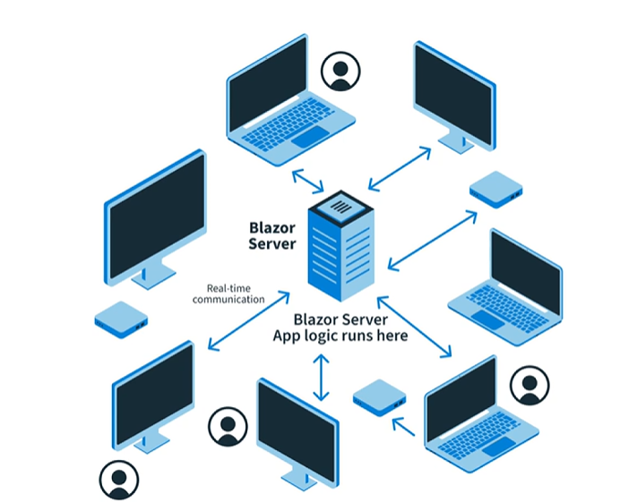
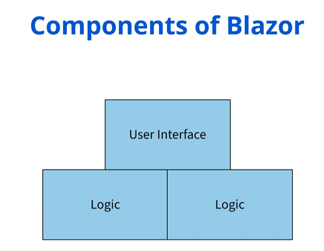

# What is Blazor

- Blazor is a **framework** for building interactive **client-side** web UI with `.NET`
- Blazor is a feature of ASP`.NET`, the popular web development framework that extends the `.NET` developer platform with tools and libraries for building web apps.
- Blazor is a single-page app framework for building interactive **client-side** web apps with `.NET`.

## Pre-requisites

- **.NET SDK**: Blazor requires the .NET Core SDK to build and run Blazor apps. You can download the .NET Core SDK from the official .NET website. [Download from here](https://dotnet.microsoft.com/en-us/download)

## Features of Blazor

- **Razor Components**: Blazor uses Razor Components to build the UI components of the application.
- **Blazor Server**: Blazor Server is a stateful app framework. It maintains the state of the app on the server.
- **Blazor WebAssembly**: Blazor WebAssembly is a stateless app framework. It maintains the state of the app on the client.
- **Blazor Hybrid**: Blazor Hybrid is a combination of Blazor Server and Blazor WebAssembly.
- **Data Binding**: Blazor supports two-way data binding. It allows you to bind data to the UI components and update the data when the UI components change.
- **Routing**: Blazor provides a built-in routing system that allows you to navigate between different pages in the application.
- **.NET Libraries**: Blazor allows you to use .NET libraries in your client-side web apps.

### Blazor Hosting Models

- **Blazor Server**: Blazor Server is a stateful app framework. It maintains the state of the app on the server.
- **Blazor WebAssembly**: Blazor WebAssembly is a stateless app framework. It maintains the state of the app on the client.

#### Blazor Server

- A hosting model where the application's logic and components run on a web server and updates are sent to the client using a real-time connection via SignalR whenever something changes
- The app's logic stay on the server while the user interacts with a lightweight version of the app in their browser.
- This helped in the loading of the app quiclky, but required constant connection to the server.

##### Advantages of Blazor Server

- It has a faster inital load.
- Centralized logic.
- Supports older browsers.
- High security.
- Ideal for applicatioons that require real-time updates.



#### Blazor WebAssembly

- A hosting model that downloads the app's code and runs it using a technology called WebAssembly, allowing the app to work even if the user's internet connection is slow or goes offline temporarily.

##### Advantages of Blazor WebAssembly

- Offline capabilities.
- Client side performance.
- No server dependency.
- Reduced hosting costs.
- Ideal for applications that require lower latency after initial load.

### Components of Blazor



## How to Run Blazor Application

1. First check your .NET SDK version by running the following command in the terminal.

    ```bash
    dotnet --version
    ```

2. Check if you have the Blazor template installed by running the following command.

    ```bash
    dotnet new list
    ```

    - if you do not have the Blazor template installed, you can install it by running the following command.

        ```bash
        dotnet new -i Microsoft.AspNetCore.Blazor.Templates
        ```

3. Create a new Blazor project by running the following command.

    - For `Blazor WebAssembly App`

        ```bash
        dotnet new blazorwasm -o BlazorApp
        ```

    - For `Blazor Server App`

        ```bash
        dotnet new blazorserver -o BlazorApp
        ```

### Important tip

- Check the [.gitignore](../) file in the root directory to see the files that are needed to be ignored by git.
